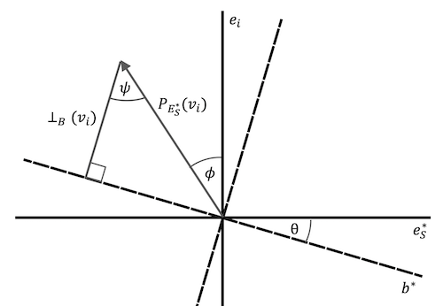
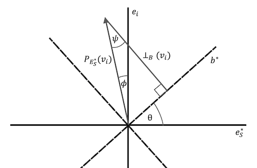

--------------------------------------------------------------------------------------------

2022-09-DD: Bounds on Vector Rejections in 2D and 3D
----------------------------------------------------

_Author(s)_: Kevin Chu `<kevin@velexi.com>`

_Last Updated_: 2022-09-15

--------------------------------------------------------------------------------------------
### Summary

TODO

--------------------------------------------------------------------------------------------
### Notation

* $n$ is the dimension of the vector space

* $\{e_1, \ldots, e_n\}$ is the standard basis for $\mathbb{R}^n$

* $\newcommand{\proj}[2]{P_{#1}\left({#2}\right)}$
  The orthogonal projection of blade $\B{A}$ onto the subspace represented by $\B{B}$:
  $\proj{\B{B}}{\B{A}}$

* $\newcommand{\rej}[2]{\perp_{#1}\left({#2}\right)}$
  If $v$ is a vector, define $\rej{C}{v}$ to be the rejection of $v$ from the subspace
  represented by $C$.

--------------------------------------------------------------------------------------------
### Assumptions

* $\{v_1, \ldots, v_n\}$ is a set of vectors that is nearly orthogonal in the sense that

  $$
  \left| \left( \frac{v_i}{\Vert v_i \Vert_2} \right) \cdot e_i \right|
  \ge \sqrt{1 - \epsilon^2}
  $$

  In terms of components, $|v_{ii}| / \Vert v_i \Vert_2 \ge \sqrt{1 - \epsilon^2}$.

### Propositions

* 2D. One vector $u$ near $y$-axis with angle $\phi$. If $v$ is near $x$-axis with angle
  $\theta$, then rejection of $u$ from $v$ satisfies something like …

  $$
  \frac{|\rej{v}{u}|}{|u_y|} \le \cos \theta \sqrt{1 - \epsilon^2}.
  $$

* 3D. One vector $u$ near $z$-axis with angle $\phi$. If $B$ is a blade near $xy$-plane
  with angle $\theta$, then rejection of $u$ from $B$ satisfies something like …

  $$
  \frac{|\rej{B}{u}|}{|u_z|} \le \cos \theta \sqrt{1 - \epsilon^2}.
  $$

  _Proof 1_: 

  * $E_S' = B \bigcap E_S$

  * $e_S^* = E_S' / E_S$

  * $E_S^* = e_S^* \wedge e_i$

  _Proof 2_: Without loss of generality, we can assume that $v_i \cdot e_i > 0$ because
  
  $$
  \frac{|\rej{B}{-v_i}|}{\Vert \proj{E_S^*}{-v_i} \Vert_2}
  = \frac{|\rej{B}{v_i}|}{\Vert \proj{E_S^*}{v_i} \Vert_2}.
  $$

  If $\theta$ is sufficiently small, then TODO

  We can reduce the proposition to a problem in planar geometry (see figures below) by
  defining the following vectors and angles:

  * $b^* = E_S' / B$

  * $\theta^*$ is the angle between $b^*$ and $e_S^*$ (positive if the rotation from
    $e_S^*$ to $b^*$ is counterclockwise in the $E_S^*$ plane)

  * $\phi$ is the angle between $\proj{E_S^*}{v_i}$ and $e_i$ (positive if the rotation
    from $e_i^*$ to $\proj{E_S^*}{v_i}$ is counterclockwise in the $E_S^*$ plane)

  * $\psi$ is the angle between $\proj{E_S^*}{v_i}$ and $\rej{B}{v_i}$.

  First, note that by definition of $E_S^*$, $|\theta^*| = \theta$. Next, observe that

  $$
  \rej{B}{v_i} = \rej{b^*}{\proj{E_S^*}{v_i}}
  $$

  because the 

  If $|\theta|, |\phi| \le \pi / 2$ and $|\theta - \phi| \le \pi / 2$, then

  There are two cases to consider (see the
  figures below):

  * $\theta$ and $\phi$ have opposite sign and

  * $\theta$ and $\phi$ have the same sign.

  Each of these cases can be further divided into two cases.

  When $\theta$ and $\phi$ have opposite sign, elementary geometric reasoning shows that
  $\psi = \phi + \theta$.

  
  
  
  When $\theta$ and $\phi$ have the same sign, elementary geometric reasoning shows that
  $\psi = |\phi - \theta|$.

  
  

  Therefore, we can conclude that

  $$
  \begin{align}
  \norm{\rej{B}{v_i}}
  &= \norm{\proj{E_S^*}{v_i}} \cos \psi \\
  &\ge \norm{\proj{E_S^*}{v_i}} \cos (\theta + \phi) \\
  &\ge \norm{\proj{E_S^*}{v_i}} \cos \theta \cos \phi \\
  &\ge \norm{\proj{E_S^*}{v_i}} \cos \theta \sqrt{1 - \epsilon^2}
  \end{align}
  $$

  TODO

--------------------------------------------------------------------------------------------
