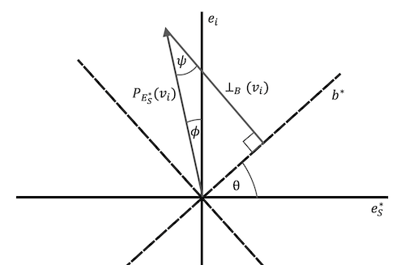

--------------------------------------------------------------------------------------------

2022-09-03: Bounds on Blades Formed From Nearly Orthogonal Vectors
------------------------------------------------------------------

_Author(s)_: Kevin Chu `<kevin@velexi.com>`

_Last Updated_: 2022-09-06

--------------------------------------------------------------------------------------------
### Summary

In this note, we derive bounds on the norm of blades formed from any nearly orthogonal set
of vectors. Without loss of generality, we assume that the collection of vectors is _near_
to the standard basis in $\mathbb{R}^n$. For vectors near an arbitrary orthonormal basis,
we replace the vector components that appear in the following propositions with the
appropriate projections onto the orthonomal basis vectors (e.g.,
$v_{ij} = v_i \cdot b_j$ where $b_j$ is the $j$-th basis vector).

--------------------------------------------------------------------------------------------
### Notation

* $n$ is the dimension of the vector space

* $\{e_1, \ldots, e_n\}$ is the standard basis for $\mathbb{R}^n$

* Let $S$ be a subset of $\{1, \ldots, n\}$ and $B$ be a blade.

  * $s = |S|$

  * Define $\proj{S}{B}$ to be the projection of blade $B$ onto the subspace
    $\bigwedge_{k \in S} e_k$.
    $\newcommand{\proj}[2]{P_{#1}\left(#2\right)}$

  * Define $\Vert B \Vert_S$ to be the 2-norm of $P_S(B)$:
    $\Vert B \Vert_S = \Vert P_S(B) \Vert_2$.

* Let $C$ be a blade.

  * If $B$ is a blade, define $\proj{C}{B}$ to be the projection of blade $B$ onto the
    subspace represented by $C$.

  * If $v$ is a vector, define $\rej{C}{v}$ to be the rejection of $v$ from the subspace
    represented by $C$.
    $\newcommand{\rej}[2]{\perp_{#1}\left(#2\right)}$

--------------------------------------------------------------------------------------------
### Assumptions

* $\{v_1, \ldots, v_n\}$ is a set of vectors that is nearly orthogonal in the sense that

  $$
  \left| \left( \frac{v_i}{\Vert v_i \Vert_2} \right) \cdot e_i \right|
  \ge \sqrt{1 - \epsilon^2}
  $$

  In terms of components, $|v_{ii}| / \Vert v_i \Vert_2 \ge \sqrt{1 - \epsilon^2}$.

### Propositions

* If $i \in S$

  $$
  \sqrt{1 - \epsilon^2} \le \frac{|v_{ii}|}{\Vert v_i \Vert_S} \le 1.
  $$

  _Proof_: The lower bound follows because $\Vert v_i \Vert_S \le \Vert v_i \Vert_2$, which
  implies that

  $$
  \frac{|v_{ii}|}{\Vert v_i \Vert_S}
  \ge \frac{|v_{ii}|}{\Vert v_i \Vert_2}
  \ge \sqrt{1 - \epsilon^2}.
  $$

  The upper bound follows because $v_{ii} \le \Vert v_i \Vert_S$ when $i \in S$.

* If $i, j \in S$ and $i \ne j$,

  $$
  \frac{|v_{ij}|}{\Vert v_i \Vert_S} \le \epsilon.
  $$

  _Proof_: Since $i, j \in S$, we can expand $\Vert v_i \Vert_S^2$ as

  $$
  \Vert v_i \Vert_S^2
  = v_{ii}^2 + v_{ik}^2 + \sum_{k \in S, k \ne i,j} v_{ij}^2.
  $$

  Solving this equation for $v_{ik}^2$ yields

  $$
  \begin{align}
  v_{ik}^2
  &= \Vert v_i \Vert_S^2 - v_{ii}^2 - \sum_{k \in S, k \ne i,j} v_{ij}^2 \\
  &\le \Vert v_i \Vert_S^2 - v_{ii}^2 \\
  &= \Vert v_i \Vert_S^2 \left( 1 - \frac{v_{ii}^2}{\Vert v_i \Vert_S^2} \right) \\
  &\le \epsilon^2 \Vert v_i \Vert_S^2.
  \end{align}
  $$

  Rearranging and taking square roots yields the desired result.

  __Corollary__. If $i \ne j$, then

  $$
  \frac{|v_{ij}|}{\Vert v_i \Vert_2} \le \epsilon.
  $$

  _Proof_: Taking $S = \{1, \ldots, n\}$ yields the desired result.

  __Corollary__. If $i \ne j$ and $\epsilon$ is sufficiently small ($\lesssim 0.78$), then

  $$
  \left| \frac{v_{ij}}{v_{ii}} \right| \le \epsilon (1 + \epsilon^2).
  $$

  _Proof_:

  $$
  \left| \frac{v_{ij}}{v_{ii}} \right|
  = \left( \frac{|v_{ij}|}{\Vert v_i \Vert_2} \right)
    \left( \frac{\Vert v_i \Vert_2}{|v_{ii}|} \right)
  \le \frac{\epsilon}{\sqrt{1 - \epsilon^2}}
  \le \epsilon (1 + \epsilon^2),
  $$

  where the last inequality follows because it equivalent to inequality

  $$
  f(x) = (1 - x^2) (1 + x^2)^2 - 1 \ge 0
  $$

  which can be shown to be true on the interval
  $\left[0, \left( \frac{\sqrt{5} - 1}{2} \right)^{1/2} \right]$ through an analysis of
  the roots of $f(x)$ and some calculus.

* Let $B = \bigwedge_{i \in S} v_i$. If $s \epsilon \le 1$
  then

  $$
  \Vert B \Vert_S \ge (1 - s \epsilon) \prod_{i \in S} \Vert v_i \Vert_S
  $$

  _Proof_. Let $\hat{v}_i$ be the subvector of $v_i$ consisting of the components whose
  indices are in $S$. We can express $\Vert B \Vert_S$ as the absolute value of the
  determinant of a matrix with columns $\hat{v}_i$:

  $$
  \left[ \begin{array}{c|c|c}
    \hat{v}_1 & \cdots & \hat{v}_s
  \end{array} \right].
  $$

  Factoring out $\newcommand{\sgn}[1]{\operatorname{sgn}\left(#1\right)}$
  $\sgn{v_{ii}} \Vert v_i \Vert_S$ from each column,

  $$
  \Vert B \Vert_S
  = \left( \prod_{i \in S} \Vert v_i \Vert_S \right)
    \left| \det \left[ \begin{array}{c|c|c}
      \frac{\sgn{v_{11}} v_1}{\Vert v_1 \Vert_S}
      & \cdots
      & \frac{\sgn{v_{ss}} v_s}{\Vert v_s \Vert_S}
    \end{array} \right] \right|.
  $$

  In this form, the matrix is close to the identity because
  $|v_{ii}| / \Vert v_i \Vert_S \ge \sqrt{1 - \epsilon^2} \ge 1 - \epsilon$ and
  $|v_{ij}| / \Vert v_i \Vert_S \le \epsilon$. Therefore, $s \epsilon \le 1$ implies that
  the determinant in the expression for $\Vert B \Vert_S$ is bounded below by
  $(1 - s \epsilon)$ [1], which yields the desired result.

  __Corollary__. If $B = \bigwedge_{i \in S} v_i$, then

  $$
  \Vert B \Vert_2 \ge (1 - s \epsilon) \prod_{i \in S} \Vert v_i \Vert_S.
  $$

  _Proof_: The result follows because $\Vert B \Vert_2 \ge \Vert B \Vert_S$.

* Let $B = \bigwedge_{i \in S} v_i$. If $s \epsilon \le 1$ and $(n-s) \epsilon \le 1$,
  then

  $$
  \frac{\Vert B \Vert_S}{\Vert B \Vert_2}
  \ge (1 - s \epsilon) \left( 1 - (n-s) \epsilon^2 \right)^{s/2}.
  $$

  _Proof_. Combining the lower bound on $\Vert B \Vert_S$ with Hadamard's inequality

  $$
  \Vert B \Vert_2 \le \prod_{i \in S} \Vert v_i \Vert_2,
  $$

  we find that

  $$
  \frac{\Vert B \Vert_S}{\Vert B \Vert_2}
  \ge \frac{(1 - s \epsilon) \prod_{i \in S} \Vert v_i \Vert_S}
           {\prod_{i \in S} \Vert v_i \Vert_2}
  = (1 - s \epsilon) \prod_{i \in S} \frac{\Vert v_i \Vert_S}{\Vert v_i \Vert_2}.
  $$

  Rearranging the identity

  $$
  \Vert v_i \Vert_2^2 = \Vert v_i \Vert_S^2 + \sum_{k \notin S} v_{ik}^2,
  $$

  we can bound $\Vert v_i \Vert_S / \Vert v_i \Vert_2$ from below:

  $$
  \left( \frac{\Vert v_i \Vert_S}{\Vert v_i \Vert_2} \right)^2
  = 1 - \sum_{k \notin S} \frac{v_{ik}^2}{\Vert v_i \Vert_2^2}
  \ge 1 - (n-s) \epsilon^2.
  $$

  Incorporating this result into our previous bound for
  $\frac{\Vert B \Vert_S}{\Vert B \Vert_2}$ yields the desired result.

  __Corollary__. If $\theta$ is the angle between $B$ and the subspace
  $\bigwedge_{k \in S} e_k$, then
  $\cos \theta \ge (1 - s \epsilon) \left( 1 - (n-s) \epsilon^2 \right)^{s/2}$.

  _Proof_: The result follows from the definition of $\cos \theta$:

  $$
  \cos \theta
  = \frac{\Vert \proj{S}{B} \Vert_2}{\Vert B \Vert_2}
  = \frac{\Vert B \Vert_S}{\Vert B \Vert_2}.
  $$

  __Corollary__. If $i \notin S$, then

  $$
  \frac{\Vert B \Vert_S}{\Vert B \Vert_{S \cup \{i\}}}
  \ge (1 - s \epsilon) \left( 1 - \epsilon^2 \right)^{s/2}.
  $$

  _Proof_: Treating $e_i \wedge \left( \bigwedge_{k \in S} e_k \right)$ as the vector
  space for the previous proposition, we have $n = s + 1$ and
  $\Vert B \Vert_{S \cup \{i\}} = \Vert B \Vert_2$, which yields the desired result.

* Assume $i \notin S$. Let

  * $B = \bigwedge_{k \in S} v_k$,

  * $E_S = \bigwedge_{k \in S} e_k$,

  * $E_S' = B \bigcap E_S$,

  * $e_S^* = E_S / E_S'$,

  * $b^* = B / E_S'$,

  * $E_S^* = e_S^* \wedge e_i$, and

  * $\theta$ be the angle between $B$ and $E_S$.

  If $s \epsilon \le 1$ and $(n-s) \epsilon \le 1$, then

  $$
  \frac{\rej{B}{v_i}}{\Vert \proj{M}{v_i} \Vert_2} \ge \cos \theta \sqrt{1 - \epsilon^2}
  $$

  _Proof_: TODO

  

  

  

  __Corollary__. TODO If $s \epsilon \le 1$ and $(n-s) \epsilon \le 1$, then

  $$
  \rej{B}{v_i} \ge v_{ii} \cos \theta \sqrt{1 - \epsilon^2}
  $$

  _Proof_: TODO

  __Corollary__. TODO If $s \epsilon \le 1$ and $(n-s) \epsilon \le 1$, then

  $$
  \frac{\rej{B}{v_i}}{\Vert v_i \Vert_{(e_i \wedge E_S)}}
  \ge \cos \theta \sqrt{1 - \epsilon^2}
  $$

  _Proof_: TODO

--------------------------------------------------------------------------------------------
### References

1. R.P. Brent, J.H. Osborn, W.D. Smith. "Note on best possible bounds for determinants of
   matrices close to the identity matrix" (2015).

--------------------------------------------------------------------------------------------
