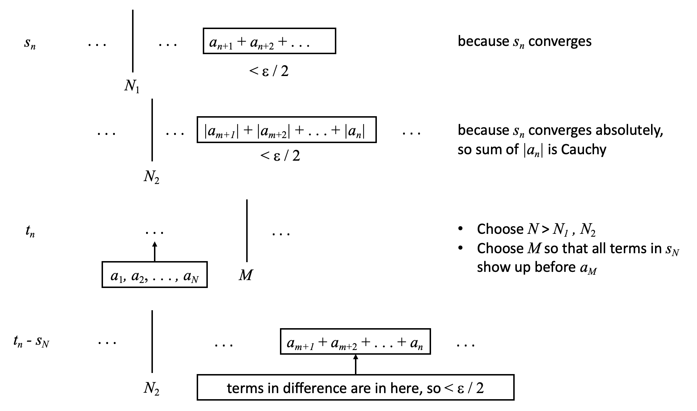

Analysis Notes
==============

_Author(s)_: Kevin Chu `<kevin@velexi.com>`

_Last Updated_: 2023-07-20

--------------------------------------------------------------------------------------------

References
----------
* S. Abbott. "Understanding Analysis". (2015)

--------------------------------------------------------------------------------------------

## 0. Prelminaries

* __Functions__

* __TODO__

--------------------------------------------------------------------------------------------

## 1. Sequences and Series

* __Functions__

* __TODO__

* __Absolutely Convergent Series__

  * _Theorem_ ("Understanding Analysis" 2.7.10): If a series converges absolutely, then
    any rearrangement of the series converges to the same limit.

    

--------------------------------------------------------------------------------------------

## 2. Topology of $\R$

--------------------------------------------------------------------------------------------
